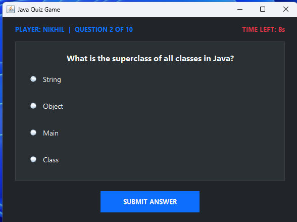

<div align="center">


**[🌐 Visit Pinnacle Labs](https://pinnacleinternship.com)**

<br/>

# 🎯 QuizGame

> A lightweight, dependency-free desktop quiz application built with Java Swing.


</div>

---

## 📌 About

**QuizGame** is a desktop application that presents multiple-choice questions, tracks scores in real time, and displays a final result screen — all built with zero external libraries. Everything runs on plain Java 16+ and the built-in Swing toolkit.


This project was developed as part of an internship at **[Pinnacle Labs](https://pinnacleinternship.com)**.

---

## 📁 Project Structure

```
QuizGame/
│
├── src/
│   └── com/quizgame/
│       │
│       ├── engine/
│       │   └── GameEngine.java       # Core game logic & state management
│       │
│       ├── model/
│       │   ├── Question.java         # Question model (text, choices, answer)
│       │   └── Quiz.java             # Quiz session (list of Questions)
│       │
│       ├── view/
│       │   └── (Swing UI panels)     # Windows, panels, answer buttons
│       │
│       └── Main.java                 # Entry point — launches the app
│
├── bin/                              # Compiled .class files
├── out/                              # Build output
├── .gitignore
└── QuizGame.iml                      # IntelliJ IDEA module file
```

---

## 🏗️ Architecture

The project uses a clean 3-layer structure.

| Layer | Package | Responsibility |
|-------|---------|----------------|
| 📦 **Model** | `com.quizgame.model` | Data — `Question` (text, choices, answer) and `Quiz` (session container) |
| ⚙️ **Engine** | `com.quizgame.engine` | Logic — tracks index, validates answers, manages score, signals game end |
| 🖥️ **View** | `com.quizgame.view` | UI — Swing panels that render questions, options, score, and results |
| 🚀 **Entry** | `Main.java` | Wires engine to view and starts Swing's event dispatch thread |

---

## ✨ Features

- ✅ Multiple-choice question format
- 📊 Live score tracking throughout the session
- 🏆 Results summary screen at end of quiz
- ⚡ Instant answer feedback (correct / wrong)
- 📦 Zero external dependencies
- 💻 Runs on any OS with Java installed

---

## ⚙️ Requirements

- Java **16 or higher**
- No build tools, no Maven, no Gradle — just `javac` and `java`

---

## 🚀 Build & Run

**Step 1 — Compile**

```bash
javac -d out src/com/quizgame/model/*.java \
             src/com/quizgame/engine/*.java \
             src/com/quizgame/view/*.java \
             src/Main.java
```

**Step 2 — Run**

```bash
java -cp out Main
```

Or in **IntelliJ IDEA** — right-click `Main.java` → **Run 'Main'**

---

## 🔄 How It Works

```
Main.java
   │
   ├──► Loads Quiz (list of Questions)
   │
   ├──► Starts GameEngine
   │         │
   │         ├── Serves questions one by one
   │         ├── Validates user answer
   │         ├── Updates score
   │         └── Signals when quiz ends
   │
   └──► View (Swing UI)
             │
             ├── Displays question + options
             ├── Shows real-time score
             └── Renders results screen
```

---

## 📄 License

```
This project is intended strictly for educational purposes.
Created as part of an internship program at Pinnacle Labs.
Not licensed for commercial use or redistribution.
```

---

## 👤 Author

<div align="center">

| | |
|---|---|
| **Name** | Nikhil |
| **Role** | Intern |
| **Organization** | [Pinnacle Labs](https://pinnacleinternship.com) |
| **Project** | QuizGame — Java Desktop Application |
| **Tech** | Java 16+, Java Swing |

<br/>

*Built with ☕ during an internship at Pinnacle Labs*

</div>
